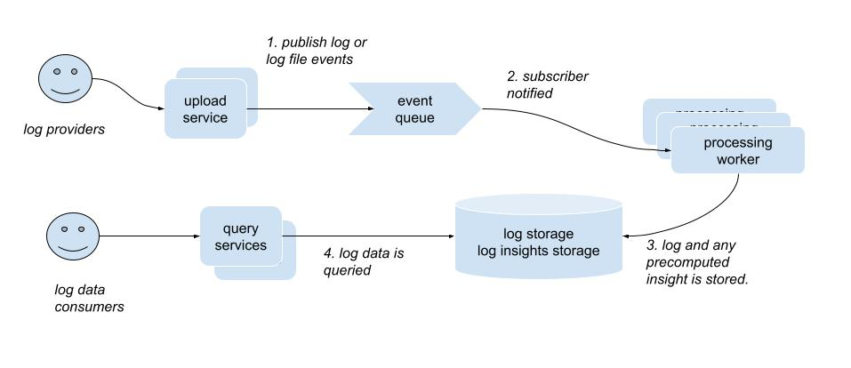

# Log Viewer Application

An extremely basic web application for uploading, viewing and analyzing log files, built with React, Node.js, express, and TypeScript.

## Features

- Upload and parse log files
- Real-time log viewing and filtering
- a basic UI built with Typescript, React and Tailwind CSS
- Containerized with Docker (in progress) for easy testing and deployment

### Accepted log file format

The log file must be a text file with one log entry per line.
with each line containing the following columns in this order:
1. timestamp (Format: YYYY-MM-DD HH:MM)
2. service (e.g., auth-service, payment-service)
3. level (one of INFO, WARNING, ERROR, CRITICAL, DEBUG)
4. message (string)

Rules:

Lines in log files are ignored if:
  - they do not contain 4 columns
  - they have non parsable data for timestamp,
  - they have a log level that is not one of INFO, WARNING, ERROR, CRITICAL, DEBUG (assumption based on provided examples)

Service and message are truncated to 255 characters (can be changed).

Assumption: These rules assume that it is better to have partial data than no data at all. 
This may or not be the right approach depending on the use case.

About logs in the future: The choice for now is to store all logs, event if they are years in the future. It was also chosen to show in-the-future-logs in the UI, for testing purposes.

## Architecture

The brief says : "The number of logs can be large. The API and database queries should be optimized for performance."

This can mean a large total amount of logs as well as large log file. There is also no
requirement for uploaded loads to be searchable and aggregated in real time. Hence the assumption: It is preferable for log files to be streamed without delay and
for expensive processing to be done asynchronously. Also, this allows for separating
the concerns of data access and data processing into separate components independently 
scaled.

The following diagram shows the components of the application and their interactions
conceptually. In the current (naive)implementation, however, all services are hosted in a
single nodejs process.



## Todos

service
- use an external authentication service like Auth0
- use a proper queue system for uploading and processing log files
- prevent duplicate uploads of the same log file
- do more preprocessing to provide more insights, including pre-aggregation, anomaly detection
- split processing into a separate app which could scale independently from data access
- investigate other storage options, including a mix object store + a fast data store for recent and aggregated data
- track processed log files and link log records to files
- save invalid logs somewhere and notify the uploader when submitted logs contain invalid data

ui
- add the ability to filter by date range
- provide more interesting visualizations, such as aggregations on multiple axes, 
- hire a UX designer
- fix login failure not communicated
- search page (in particular) not responsive

devx
- use [testcontainers](https://testcontainers.com/) for database access testing (instead of sqlite)
- create a CI pipeline
- get TS compilation to work! (it's not working at the moment)
- increase test coverage

## Running (requires docker) -- NOT WORKING YET

Build the Docker image
```bash
docker build -t logviewer .
```

Create an .env file with the following variables
```
SESSION_SECRET=<a random string for express session management>
DB_USER="postgres" unless a change in the database in init is made
DB_PASSWORD="postgres" unless a change in the database in init is made
DB_URL="postgresql://<DB_USER>:<DB_PASSWORD>@localhost:5432/logviewer"
```

docker compose can then be used to 
1. initialize and run both a postgresql database running on port 5432
2. and the log viewer application on port 3000
```bash
docker compose up -d --env-file ./.env
```

Next, point your browser to http://localhost:3000 to view the application. You will 
notice that you need to authenticated in other to use it. To create a user, you can
use the following curl command:
```bash
curl -X POST http://localhost:3000/api/auth/register \
  -H "Content-Type: application/json" \
  -d '{"username": "<pick a username>", "password": "<pick a password>"}'
```

### Development

Please refer to instructions specific each component:
- [services](./api/README.md)
- [user interface](./ui/README.md)


